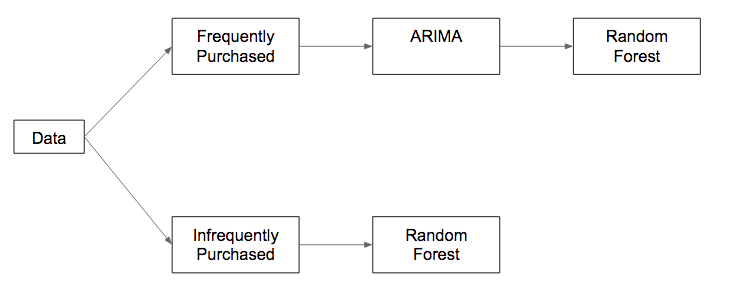

```{r}

# If TRUE, runs all of the main code. This will take a lot of time
# If FALSE, will not run - this is best for quick knitting if all images area already loaded
run_main_code <- FALSE

```

```{r setup, include=FALSE}
knitr::opts_chunk$set(echo = TRUE)
```

## Introduction

Forecasting sales is difficult, yet vitally important for grocery stores. Many items are perishable, and need to be sold soon after arrival. If the store orders too many supplies, they may have to discard a large portion of them. If they don’t order enough, they will miss out on potential sales when they run out of stock. An Ecuadorian-based grocery giant, Corporacion Favorita, relies on rudimentary forecasting techniques. They admit that they “currently rely on subjective forecasting methods with very little data to back them up and very little automation to execute plans.” Corporacion Favorita decided to implement data science methods in order to more accurately forecast sales. They posted a competition on Kaggle where they provided all sales data for all of their stores over a four-year period. 

We built a model to analyze the training data, and predict the test data provided by Corporacio Favorito. Our model pipeline uses historical data to predict the unit sales of a given item. The first step was combining the different datasets provided by Corporacion Favorita. The data included roughly 200,000 products, several years of daily transactions for 54 distinct stores, and oil prices.

## Project Report

Note that the data to run this file can be downloaded from the following URL:
https://www.kaggle.com/c/favorita-grocery-sales-forecasting/data
Since the file is compressed in 7z format, unzipping programatically is not possible. Additionally, note that all graphics are loaded from images that are generated by the complete code base, which is included after the report.

## Data Wrangling

We combined these different datasets with the training data. We joined these datasets together with various unique identifiers, such as item number, store number and date. We also spread every categorical variable to a binary variable and added numerical variable for the days since the last pay day (which is the 15th and last day of each month for the public sector of Ecuador).

## Pipeline

A diagram of the dual model pipeline is shown below:



We split our dataset into two groups: items that were purchased frequently and infrequently. For a given item, it is considered frequently purchased if for every store it is sold in, it was purchased every day the store was open. When training the model, only the last two weeks were considered (the two weeks leading up to the testing dataset). A graph of the distribution of item popularities is shown below. It shows that a significant proportion of items were sold every day.


We divided our data this way because of an important nuance to the individual observations. Interestingly, our training and test data sets are composed of unit sales by item and store conditional on their purchase. We don’t have data on items that weren’t purchased and have no information on which items are in stock. Forecasting sales for items that don’t have data every day would be fitting a model to dangerously incomplete data. Consequently, in order to responsibly use the ARIMA model to pick up patterns over time, we must limit its scope to the frequently purchased items described above.

##The ARIMA Model

The process from a bird’s eye view:

1.  The data is differenced in order to create a stationary time series.
2.  The stationary time series is analyzed using AR and MA processes, which describe how the observations move back towards the mean of a stationary series after a shock.
3.  The seasonality and trend of the data are added back in order to make forecasts.

Why did we use this model?

First and foremost, it is important to understand why time series data is different from the average data we input into a standard regression model. From linear regression to random forests, the data scientist usually assumes that his/her data is independently distributed. In other words, there is an expectation that observing one observation will tell us nothing about the values that precede or follow it (https://stats.stackexchange.com/questions/259357/what-is-implied-by-i-i-d). This assumption is clearly violated in time series. Let me demonstrate this assertion with an example. Suppose the United States GDP has been rising over the recent past and analysts hypothesize that the economy is following an upward trend in the business cycle. Let's say (conservatively), that the whole US Economy is 10 dollars and the decade moving average (the average GDP over the last decade) is 5 dollars. What is the United States GDP going to be next year? If your answer to this is "I have no idea" then a linear model will work very well for this data. The observation of a value in one time period tells you nothing about the value in the next. However, most economists would disagree with this reaction. They would likely observe that the US GDP does not move very fast and that patterns in GDP values seem to generally follow a cycle. Consequently, they might put a higher probability on GDP going down and predict that next year's value will be between 9 and 10.5 dollars. On the other hand, if the current GDP was 5 dollars, these forecasts would look very different because of slow GDP movement and a different position in the business cycle (possibly between 4 and 6). Consequently, this example (which is actually especially pertinent since many time series techniques have been centered around predicting business cycles) and many other instances of sequential or time-dependent data will not fit within the constraints and assumptions of normal regression models. 

It is easy to see that grocery sales data fits into this troublesome category. Whether there is: 

1.Weekly seasonality (people tend to buy their groceries when they are free on the weekend)
2. Yearly seasonality (cartons of ice cream are sold less frequently in the winter)
3. Long term growth or decline (competitors are entering/leaving the market)
4. The simple relationship between two observations (if there is a high number of grocery sales on one day, there will be a low sale the next day because people have bought all the tomatoes they needed for the week).

How do we account for these components in our data? This is where ARIMA enters the scene.

ARIMA?

The Autoregressive Integrated Moving Average Model is ideal for short-term forecasts of time series with one seasonal component. Separating this procedure by its distinct components is the best way of understanding its functionality.

The “I” – Before we can talk about the relationship between a current value and its past instances, it is important to simplify the data. Time series patterns can often be separated into three general components.


The diagram above begins with the data in its raw state. Although this depiction seems very chaotic, it is clear that there are general long-term trends inherent to the data. In order to account for these, the ARIMA model begins by "differencing" the data. This process is simply taking one observation and subtracting the observation behind it in order to remove persistent growth or decline patterns. It can be best understood intuitively with a simple example. Imagine that sales growth increased by one unit every day over the past work week from 1 unit to 5 units. If we differenced this time series, the new sales data would be a sequence of 1's (3-2 = 1, 4-3 = 1 etc.), effectively removing the increasing trend. However, let's say that along with this simplistic pattern, shoppers decide that Wednesday is the most important day to shop and unit sales spike for that day from 3 to 7. After differencing the data, (1,2,7,4,5 --> 1,1,5,-3,1), the upward trend is removed, but the general shape of spiking up to Wednesday and falling back down on Thursday is preserved. The same process and intuition is used to remove seasonality from the data by subtracting a value in the equivalent time period (the value last week, last month or last year depending on the seasonality being observed) from the current value. These differencing manipulations are performed and then stored in the model so that they can be undone when forecasting values. The "integrated" part in ARIMA (the “I”) simply means that this process has been completed. 

Therefore, differencing removes the predictable time patterns from the data (trend and seasonality) in order to isolate the time-independent relationship between a current value and the observations that come before it. "Time-independence" here does not mean that we are no longer dealing with time series. Rather, it suggests that we are now able to observe patterns to the data that do not change with general time periods (trend) or calendar cycles (seasonality). This time series is now referred to as "stationary." There are a couple interesting properties of a stationary process, but the one that will be important moving forward is that values fluctuate around a mean because long term trends and seasonal patterns have been removed.

"AR" and "MA" - However, now that we have isolated the time-independent stationary time series, how do we effectively model it? It seems like we have already removed the patterns that we typically think about when trying to describe time series data, so what else is there to analyze? This is a very legitimate question, and one I definitely considered when learning about the ARIMA model.  The answer is nuanced and very interesting. Again, I believe this is best explained using an example. Suppose that tomato sales in Quito are following a predictable weekly pattern. People typically tend to buy their tomatoes on Sunday, but they also buy them on Saturday after making a curtido de cebolla y tomate (looks delicious - https://www.laylita.com/recipes/curtido-de-cebolla-y-tomate-pickled-red-onion-and-tomato-salad/) for dinner Sunday night. Now, let’s say that one week tomatoes are especially sweet and ripe on Sunday and consumers decide to buy more than usual. How do the normal tomato buying patterns respond to this shock? Do consumers decide to buy more on Saturday because they have determined that tomatoes will be the staple of their dishes for this week? Do they buy less because they already have enough tomatoes to last for the near future? Is their consumption on Saturday unaffected? In this case, I feel like I can confidently forecast that tomato sales will drop below normal levels Saturday and eventually return to normal levels (although you can see how other items may be more ambiguous, e.g. wine and other luxury items). But, how far does it drop and how long does it take to return to normal? These are the questions that the ARMA (without the “I” because the time series has already been differenced) model attempts to answer.

ARMA does this with autoregressive and moving average regression terms.  These two concepts can be best understood as different ways of modeling the relationship between a current value and the values that come before it. Let’s use the examples I outlined above.

In basic mathematical terms, an autoregressive process is:

$Y{_t} = b + aY{_{t-1}} + e{_t}$

In other words, it is simply the current value predicted from the value before it, multiplied by a constant, plus an error term. It is important to remember that stationary time series values will fluctuate around a mean and therefore “a” cannot be greater than 1 (that way the value will eventually progress back to b). In the previous example, one possible outcome after increased tomato purchases on Sunday is that consumers decide to make tomatoes the staple of their meals for the week, and keep on purchasing more tomatoes than they normally would for a few days afterward. In this case, the effect of an initial shock will persist for a while in smaller and smaller levels throughout the week until it becomes effectively zero.

In basic mathematical terms, a moving average process is:

$Y{_t} = b + ce{_{t-1}} + e{_t}$

In other words, it is simply the current value predicted from the error term before it, multiplied by a constant, plus an error term. While an autoregressive process describes a slow progression toward the mean of the series, the moving average term can model quick changes. In the previous example, a different possible outcome is that consumers decide that they have enough tomatoes, and purchase less tomatoes than average for the next few days. In this case, the effect of a shock only lasts for the subsequent time period, after which tomato sales return to their normal levels.

There are other interesting examples here: https://www.analyticsvidhya.com/blog/2015/12/complete-tutorial-time-series-modeling/


How does the ARMA model fit AR and MA terms?


Basically, the ARMA model is fitted by calculating the correlation of the current value with its “lags” aka its historical values. After generating these relationships, we can fit the descriptions detailed above to the plots of these correlations. 

While the first plot looks like an autoregressive process because of the gradual decay, the one below it looks like the sudden decline that is indicative of a moving average process. As you can imagine, the more complicated the ACF plots, the more likely more AR and MA terms (and a combination of both) are needed to fit the pattern. It is also necessary to determine the amount of AR and MA terms by using partial correlation plots (in order to figure exactly which lags are uniquely correlated with the current value, but the math associated with this computation is outside the scope of this explanation). 

See the full explanation of how to fit ARIMA models “by hand” here: https://www.datascience.com/blog/introduction-to-forecasting-with-arima-in-r-learn-data-science-tutorials

How does it all come together?

At the end of the day, it was not incredibly important to understand the nitty-gritty of the ARMA fitting process because the auto.arima() function does it for us! This is very convenient and means we can focus on the intuition of the process and the results. 

There are two important limitations:

1.  The ARIMA model can only model one type of seasonality at a time. We identified that weekly seasonality would be the most important dimension, but are definitely missing out on possible yearly seasonality (for example, more dairy product in the hot season) because of the limitations of the model in R.
2.  The ARMA model is only useful in the very short term because it predicts a regression to the mean (or trend/seasonality once the time series has been un-differenced). After the effects of a shock peter out, the ARIMA model will continue to predict the trend/seasonality of the time series without any variation. This was not a problem for this kaggle competition, as the challenge was only to predict short-term sales.


What did we use ARIMA for?

At the end of the day, we used the ARIMA model to predict the average unit sales of highly frequented item families over the next two weeks. We were able to get a sense of the popularity of different classes over this short time period by using the forecasts generated by our model. We also learned so much about time series and ARIMA in the process!

Here is the code for how the ARIMA model is constructued.

```{r, eval=FALSE}
grocery_daily_sales <- daily_sales %>% filter(item_family == "GROCERY I") #filter by the class
grocery_ts <- ts(grocery_daily_sales$daily_class_sales, frequency = 7) #create the time series with a week period
grocery_ts <- tsclean(grocery_ts) #remove outliers
grocery_ts_arima <- auto.arima(grocery_ts)
forecast <- forecast(grocery_ts_arima, h= 14)
```

The results:


## Random Forest Model Building

For infrequently purchased items a random forest was used on the dataset. A random forest is an ensemble method that combines many regression decision trees. A regression decision tree splits a dataset on a variable at each branch. A random forest, averages all of the values of many regression trees together to create a final output value. The processing of averaging together the results of many trees helps reduce bias and variance. The decision tree for the infrequently purchased items is shown below:

We used a sample of 34,000 observations from the 15 days of our dataset that came directly before the 14 days in the test dataset. The 15 days correspond to 8/1/2016 through 8/15/2016. Our computational power was limited, so we decided that the most recent data would be the most relevant to predicting short-run test observations, as seasonal trends would not have a large effect over a short period of time. Additionally, there were no major holidays or unusual occurrences such as a recession or a natural disaster during the entire month of August 2016 in Ecuador, which further supports that sales trends in the first 15 days of the month are likely to be relatively similar to sales trends in the next 14 days of the month.

We included the following variables in our random forest, as each had an impact on unit sales:


We split the categorical variables “item family,” “store city,” “store cluster,” “store type,” and “day of week” into many binary variables. The variable “item perishable” was already binary, and the variables “days since payday,” “oil price,” and “popularity” were continuous.

“Store cluster” and “store type” were provided to us by Corporacion Favorita without much intuition as to what different clusters and types actually correspond to. While this felt a bit odd, we decided to nonetheless include these variables in our random forest model because they demonstrated that they had a large influence on the expected number of unit sales.

In the public sector of Ecuador, paydays occur on the 15th day of each month, as well as on the last day of each month. We speculated that workers would tend to spend more soon after their payday. Although our data did not definitively show a trend, we decided to include this variable because Corporacion Favorita recommended that we do so.

The data for oil price given to us in the dataset was incomplete, with about half of the values missing. The missing values were very evenly dispersed, so we fixed this problem by replacing missing values with the most recently occurring non-missing value.

The “popularity" variable was created by applying the ARIMA model to each row in the training dataset. All the other variables were included in both random forests, while the “popularity” variable was only included in the random forest for highly-transacted items.

## Findings

We trained our random forest and found that the following variables were important:


“Popularity” was the most important variable, which means that our ARIMA model indeed contributed useful information. Variables corresponding to item family were also among the most important. This is not surprising because the charts above demonstrated that item family exhibited the strongest influence on expected unit sales out of all of the variables that we included in the random forest model.

We held out 30% of our 30,000 observations as test data, and used these to analyze the accuracy of our model. The below plot shows the scaled error for each branch of the pipeline. Scaled error is absolute error proportional to unit sales. For example, if actual sales were 5, and we predicted 10 then the scaled error would be (10-5)/5 = 2.


Overall our model did a mediocre job predicting sales. It often predicted incorrectly, often by a large factor.

To predict the Kaggle test set, we first split the test set into highly-transacted and non-highly-transacted items based off our existing classification. Corporacion Favorita included a small number of items not seen in the training set in their test set. We labeled these items as non-highly-transacted because the majority of items are non-highly-transacted. After splitting the data, we applied the appropriate random forest to each half of the data, and merged and submitted the results. Our submission ended up in the 10th percentile. This was a disappointing result.

## Limitations

The most important improvement we could make to increase the accuracy of our model would be to use more data. We only used 0.05% of the 125 million training observations provided by Corporacion Favorita to train our random forest models. With more computational power, we could train more accurate models, and generate more accurate predictions.

Another improvement to the model would be to incorporate external data sets into our analysis. These include data relevant to the holidays, which can impact demand for specific items associated with cultural customs related to the holidays. Second, economic data about the country of Ecuador would also have been useful. Economic data would give a sense of the spending power of customers, and help forecast larger trends in demand of different items. Third, weather data also likely impacted sales. While month gives a good approximation, deviations beyond the average weather cycles likely also affect the demand for certain items. Including external data sets would be useful in making a model that predicts long-term trends, forecasting months into the future. Including these datasets is not as relevant to the challenge we faced, which was only to predict data for the next two weeks. Across the 29 days spanned by the training and test data we used, these measures did not change much. For example, Ecuador’s unemployment rate was 5.4% in 2016 and 5.8% in 2017, and the monthly change was likely even smaller than that.

We could make our model more realistic by adding data for when there were zero sales. This would allow us to put all of our data through the ARIMA pipeline. Time series models assumes data points exist for every day. These models can only apply to items that have data for every day, which in this case was limited to highly-transacted items. Adding zero data would allow us to apply time series forecasting to the whole dataset. Although adding zero data would cause our model to generate more realistic predictions, these predictions would likely do more poorly in the Kaggle competition, as the test data also doesn’t include data for when there were no sales, and thus the competition favors models that overestimate sales.

Our models are only trained on Corporacion Favorita stores in Ecuador. This limits the generalizability of the models produced from this code. There would likely be limitations to applying these models to different countries, or even different grocers within Ecuador.

\newpage

# CODE

# IMPORTANT NOTES

```{r, eval=run_main_code}

# 1. Set to TRUE to import all relevant CSV files. Only need to do this once
LOAD_CSV_DATA <- TRUE

# 2. Set this value to TRUE to install all of the relevant packages. Only need to do this once
DO_INSTALL_PACKAGES <- TRUE

# 3. Set TRUE to use small sample. Set to FALSE to use more data, which may take hours  
SMALLER_SAMPLE <- TRUE

# 4. Create a directory named "plots" on the same level as this .Rmd file. This code assumes the existence of that directory, saves all charts there

```

TABLE OF CONTENTS:

SECTIONS:

A -- Setup:

# 1. Install packages
# 2. Load data from CSV

B -- Main Code:

# 1. Joining tables
# 2. Sample training data, merge into one big table
# 3. Add variables to table
# 4. Split big table into separate rf, arima, and test tables
# 5. Train ARIMA model
# 6. Add ARIMA predictions to rf and test tables
# 7. Train RF models
# 8. Predict test data

C -- Data Visualization:

# 1. Different variables' influence on sales
# 2. Variable importance for two random forests
# 3. Plotting errors in sample test

# Section A -- Setup

# 1. Install packages
```{r, eval=run_main_code}

if (DO_INSTALL_PACKAGES) {
  install.packages("data.table")
  install.packages('ggplot2')
  install.packages('ggthemes')
  install.packages('scales')
  install.packages('dplyr')
  install.packages('mice')
  install.packages('class')
  install.packages('lubridate')
  install.packages('caret')
  install.packages('tseries')
  install.packages("forecast")
  install.packages('tidyr')
}

library('data.table')
library('ggplot2')
library('ggthemes')
library('scales')
library('dplyr')
library('mice')
library('class')
library('lubridate')
library('caret')
library('tseries')
library('forecast')
library('tidyr')

```

# 2. Load data from CSV
```{r, eval=run_main_code}

if (LOAD_CSV_DATA) {
  train <- fread("train.csv")
  holidays <- fread("holidays_events.csv")
  items <- fread("items.csv")
  oil <- fread("oil.csv")
  stores <- fread("stores.csv")
  test <- fread("test.csv")
}

```


# Section B -- Main code

# 1. Joining tables
# 2. Sample training data, merge into one big table
# 3. Add variables to table
# 4. Split big table into separate rf, arima, and test tables
# 5. Train ARIMA model
# 6. Add ARIMA predictions to rf and test tables
# 7. Train RF models
# 8. Predict test data

# 1. Joining tables
```{r, eval=run_main_code}

# Set names
cols <- names(holidays)[-1] # Except for date
setnames(holidays, (cols), paste("holiday_", (cols), sep=""))

cols <- names(items)[-1] # Except for item_nbr
setnames(items, (cols), paste("item_", (cols), sep=""))

setnames(oil, "dcoilwtico", "oil_price")
setkey(oil, date)

# Remove NA values from oil by using last recorded price
set(oil, 1L, "oil_price", oil[2,oil_price]) # First row was NA, so use value of 2nd row
oil_price_na <- is.na(oil$oil_price)
last_oil_price <- oil[1,oil_price]
for (i in 1:length(oil_price_na)) {
  if (oil_price_na[i]) {
    set(oil, i, "oil_price", last_oil_price)
  } else {
    last_oil_price <- oil[i,oil_price]
  }
}

# Add missing dates.

get_oil_row <- function(y, m, d, price) {
  m <- formatC(m, width = 2, flag = "0")
  d <- formatC(d, width = 2, flag = "0")
  return(list(paste(y,m,d,sep="-"), price))
}

for (i in 1:length(oil_price_na)) {
  cur_date <- oil[i, date]
  cur_year <- as.integer(substr(cur_date,0,4))
  cur_month <- as.integer(substr(cur_date,6,7))
  cur_day <- as.integer(substr(cur_date,9,10))
  cur_oil_price <- oil[i, oil_price]
  
  # Don't check the first row
  if (i != 1) {
    
    # Add days last month and to the start of this month
    if (cur_month != last_month) {
      
      # Last month
      if (31 >= last_day + 1) {
        for (d in (last_day + 1):31) {
          oil <- rbind(oil, get_oil_row(last_year, last_month, d, last_oil_price))
        }
      }
      
      # Start of this month
      if (cur_day - 1 >= 1) {
        for (d in 1:(cur_day - 1)) {
          oil <- rbind(oil, get_oil_row(cur_year, cur_month, d, last_oil_price))
        }
      }
    }
    
    # For all skipped days in the same month
    else if (cur_day - 1 >= last_day + 1) {
      for (d in (last_day + 1):(cur_day - 1)) {
        oil <- rbind(oil, get_oil_row(cur_year, cur_month, d, last_oil_price))
      }
    }
    
  }
  
  last_year <- cur_year
  last_month <- cur_month
  last_day <- cur_day
  last_oil_price <- cur_oil_price
}


cols <- names(stores)[-1] # Except for store_nbr
setnames(stores, (cols), paste("store_", (cols), sep=""))

# Join with items
setkey(train, item_nbr)
setkey(items, item_nbr)
train <- merge(train, items, all.x = TRUE)

# Join with oil
setkey(train, date)
setkey(oil, date)
train <- merge(train, oil, all.x = TRUE)

# Join with stores
setkey(train, store_nbr)
setkey(stores, store_nbr)
train <- merge(train, stores, all.x = TRUE)


# Same, for test data

# Join with items
setkey(test, item_nbr)
setkey(items, item_nbr)
test <- merge(test, items, all.x = TRUE)

# Join with oil
setkey(test, date)
setkey(oil, date)
test <- merge(test, oil, all.x = TRUE)

# Join with stores
setkey(test, store_nbr)
setkey(stores, store_nbr)
test <- merge(test, stores, all.x = TRUE)

```

# 2. Sample training data
```{r, eval=run_main_code}

# RF dataset: sample from last 15 days
set.seed(888)
if (SMALLER_SAMPLE) {
  p <- 50000/(125497040 - 123926072) # Proportion we want to sample (total, num. before Aug. 1 2016)
} else {
  p <- 200000/(125497040 - 123926072) # Proportion we want to sample (total, num. before Aug. 1 2016)
}
setkey(train, date)
ndt <- train[, .(n = .N), by = date]
indices <- c()
start <- end <- 1 + 123926072
num_days <- nrow(ndt)
for (i in (num_days - 14):num_days) {
  n <- ndt[i,n]
  end <- start + n - 1
  new_indices <- sample(start:end, as.integer(n * p))
  new_indices
  indices <- c(indices, new_indices)
  start <- end + 1
}
sandbox_rf <- train[indices,]

# ARIMA Reduced data set to work with (whole time period)
if (SMALLER_SAMPLE) {
  p <- 0.05
} else {
  p <- 0.15 # Use a lot of training data for ARIMA
}
setkey(train, date)
ndt <- train[, .(n = .N), by = date]
indices <- c()
start <- end <- 1
num_days <- nrow(ndt)
for (i in 1:num_days) {
  n <- ndt[i,n]
  end <- start + n - 1
  new_indices <- sample(start:end, as.integer(n * p))
  new_indices
  indices <- c(indices, new_indices)
  start <- end + 1
}
sandbox_arima <- train[indices,]

# Class var: 0 - RF, 1 - ARIMA, 2 - TEST - to keep track of this split we made
setDT(sandbox_rf)
setDT(sandbox_arima)
setDT(test)
sandbox_rf[,class := 0]
sandbox_arima[,class := 1]
test[,class := 2]

sandbox <- rbind(sandbox_rf, sandbox_arima)
sandbox <- rbind(sandbox, test, fill=TRUE)

num_rf <- nrow(sandbox_rf)
num_arima <- nrow(sandbox_arima)

```

# 3. Add variables
```{r, eval=run_main_code}

# Add cols for "year", "month", "weekday", "days_since_payday"

base <- c(2,5,5,1,3,6,1,4,0,2,5,0, 
          3,6,6,2,4,0,2,5,1,3,6,1, 
          4,0,0,3,5,1,3,6,2,4,0,2, 
          5,1,2,5,0,3,5,1,4,6,2,4,
          0,3,3,6,1,4,6,2)
sandbox[,year := as.integer(substr(date,0,4))]
sandbox[,month := as.integer(substr(date,6,7))]
sandbox[,weekday := as.integer(substr(date,9,10))]
sandbox[,days_since_payday := ifelse(weekday < 15, weekday, weekday - 15)]
sandbox[,weekday := ((base)[(year - 2013L)*12 + month] + weekday) %% 7]

# Make a categorical variable for each weekday
weekday_names <- c("Sun", "Mon", "Tues", "Weds", "Thurs", "Fri", "Sat")
for (i in 1:7) {
  weekday_name <- weekday_names[i]
  sandbox[,(weekday_name) := weekday == (i)]
}

# Make a categorical variable for each item family 
item_families <- unique(sandbox$item_family)
for (i in 1:length(item_families)) {
  cur_item_family <- item_families[i]
  sandbox[,(cur_item_family) := item_family == (cur_item_family)]
}

# Make a cat. var. for each store city
store_cities <- unique(sandbox$store_city)
for (i in 1:length(store_cities)) {
  cur_store_city <- store_cities[i]
  sandbox[,(cur_store_city) := store_city == (cur_store_city)]
}

# Make a binary variable for each store cluster
store_clusters <- unique(sandbox$store_cluster)
for (i in 1:length(store_clusters)) {
  cur_store_cluster <- store_clusters[i]
  sandbox[,(paste("Cluster", cur_store_cluster)) := store_cluster == (cur_store_cluster)]
}

# Make a binary variable for each store type
store_types <- unique(sandbox$store_type)
for (i in 1:length(store_types)) {
  cur_store_type <- store_types[i]
  sandbox[,(paste("Store Type", cur_store_type)) := store_type == (cur_store_type)]
}

# Adding months and days since Jan. 1 2013 (both starting at 1)
sandbox[,month_count := 12 * (year - 2013) + month]

```

# 4 Splitting into separate rf, arima, and test tables
```{r, eval=run_main_code}

# Make data table for which items are sold every day
tmp <- train[date == "2017-08-01"]
cut <- min(tmp$id)

# Choose those sold every day
setkey(train, id)
t_pop <- train[id >= (cut), j = .(n = .N), by = .(store_nbr, item_nbr)]
t_pop[,popular := n == 15]

# Split sandbox accordingly
setDT(t_pop)
setkey(sandbox, store_nbr, item_nbr)
setkey(t_pop, store_nbr, item_nbr)
s_all <- merge(sandbox, t_pop, all.x = TRUE)

# For NA values, assume popular is false
s_all[,popular := ifelse(is.na(popular),FALSE,popular)]

# Splitting back up by class
sandbox_rf2 <- s_all[class == 0]
sandbox_rf2[,class:=NULL]
arima2 <- s_all[class == 1]
arima2[,class:=NULL]
test2 <- s_all[class == 2]
test2[,class:=NULL]

rf_popular <- sandbox_rf2[popular == TRUE]
rf_not_popular <- sandbox_rf2[popular == FALSE]
arima_popular <- arima2[popular == TRUE]
test_popular <- test2[popular == TRUE]
test_not_popular <- test2[popular == FALSE]

```

# 5. Train ARIMA Model
```{r, eval=run_main_code}

family_data <- data.frame()
daily_sales <- arima_popular %>% group_by(date,item_family) %>% summarise(daily_class_sales = mean(unit_sales)) %>% filter(date > as.Date('2016-1-1')) #take the data from 2016 onwards 

for (i in unique(daily_sales$item_family)){
  daily_sales_ts <- daily_sales %>% filter(item_family == i) #filter by the class
  ds_ts <- ts(daily_sales_ts$daily_class_sales, frequency = 7) #create the time series with a week period
  ds_ts <- tsclean(ds_ts) #remove outliers
  ds_ts_arima <- auto.arima(ds_ts) #take out stepwise and 
  #approximation to make it go faster
  forecast <- forecast(ds_ts_arima, h= 14) #forecast 14 days ahead
  forecast_values <- forecast$mean #obtain the values for the forecast
  family_data <- rbind(family_data, forecast_values) #add these to the dataframe
}

family_data <- cbind(unique(daily_sales$item_family), family_data) #add family names to data frame
colnames(family_data) <- c("Family",1:14)

tidy_family_data <- gather(family_data,"Day","Sales",2:15) #tidy up
tidy_family_data$Day <- as.numeric(tidy_family_data$Day)

```

# 6. Add ARIMA results to other rf and test tables
```{r, eval=run_main_code}

# Clean up to get cols "date", "item_family", "popularity"

train_pop_data <- daily_sales
setDT(train_pop_data)
setnames(train_pop_data, "daily_class_sales", "popularity")

test_pop_data <- tidy_family_data
setDT(test_pop_data)
setnames(test_pop_data, c("Family", "Day", "Sales"), c("item_family","date","popularity"))
test_dates <- unique(test$date)
test_pop_data[,date := (test_dates)[date]]

# Join with rf_popular and test_popular

setkey(rf_popular, date, item_family)
setkey(train_pop_data, date, item_family)
rf_popular <- merge(rf_popular, train_pop_data, all.x = TRUE)

setkey(test_popular, date, item_family)
setkey(test_pop_data, date, item_family)
test_popular <- merge(test_popular, test_pop_data, all.x = TRUE)

# Change NA values to 0
rf_popular[,popularity := ifelse(is.na(popularity),0,popularity)]
test_popular[,popularity := ifelse(is.na(popularity),0,popularity)]

```

# 7. Train random forests
```{r, eval=run_main_code}

# Train/test data for popular items
set.seed(888)
s_p_indices <- sample(1:nrow(rf_popular), 0.7*nrow(rf_popular))
s_p_train <- rf_popular[s_p_indices]
s_p_test <- rf_popular[-s_p_indices]

# Train/test data for unpopular items
set.seed(888)
s_np_indices <- sample(1:nrow(rf_not_popular), 0.7*nrow(rf_not_popular))
s_np_train <- rf_not_popular[s_np_indices]
s_np_test <- rf_not_popular[-s_np_indices]

# Variables to use for the random forest
s_p_cols <- s_np_cols <- c("unit_sales", item_families, paste("Cluster",store_clusters), store_cities, paste("Store Type", store_types), weekday_names, "days_since_payday", "item_perishable", "oil_price")
s_p_cols <- c(s_p_cols, "popularity")

# Model for popular items
p_model_data <- s_p_train[,s_p_cols, with=FALSE]
set.seed(888)
p_model <- train(unit_sales ~ . , data=p_model_data, method="rf",
                  trControl = trainControl(method="oob"),  # Use the OOB error rate 
                  ntree=500, tuneGrid = data.frame(mtry=((length(s_p_cols) - 1))/3),
                  importance = TRUE)  # need this for variable importance below
p_predictions <- predict(p_model, newdata = s_p_test)
p_predictions <- ifelse(p_predictions < 0, 0, p_predictions)
p_actual <- s_p_test$unit_sales
p_actual <- ifelse(p_actual < 0, 0, p_actual)
p_accuracy <- sum((log(p_predictions + 1) - log(p_actual + 1)) ** 2) / length(p_predictions)
p_accuracy

# Model for unpopular items
np_model_data <- s_np_train[,s_np_cols, with=FALSE]
set.seed(888)
np_model <- train(unit_sales ~ . , data=np_model_data, method="rf",
                  trControl = trainControl(method="oob"),  # Use the OOB error rate 
                  ntree=500, tuneGrid = data.frame(mtry=((length(s_np_cols) - 1))/3),
                  importance = TRUE)  # need this for variable importance below
np_predictions <- predict(np_model, newdata = s_np_test)
np_predictions <- ifelse(np_predictions < 0, 0, np_predictions)
np_actual <- s_np_test$unit_sales
np_actual <- ifelse(np_actual < 0, 0, np_actual)
np_accuracy <- sum((log(np_predictions + 1) - log(np_actual + 1)) ** 2) / length(np_predictions)
np_accuracy

# Importance
p_model_imp <- varImp(p_model)$importance
np_model_imp <- varImp(np_model)$importance

```

# 8. Predict test data
```{r, eval=run_main_code}

# Predict test_popular and test_not_popular
test_p_predictions <- predict(p_model, newdata = test_popular)
test_p_predictions <- ifelse(test_p_predictions < 0, 0, test_p_predictions)
test_np_predictions <- predict(np_model, newdata = test_not_popular)
test_np_predictions <- ifelse(test_np_predictions < 0, 0, test_np_predictions)

# Output to csv
final_predictions <- data.table(id = c(test_popular$id, test_not_popular$id), unit_sales = c(test_p_predictions, test_np_predictions))
fwrite(final_predictions, "final_predictions.csv")

```


# Section C -- Data visualization

# 1. Store popularity
# 2. Arima model
# 3. Different variables' influence on sales
# 4. Variable importance for two random forests
# 5. Plotting errors in sample test
# 6. Affect of popularity on unit sales

# 1. Store popularity
```{r, eval=run_main_code}

ggplot(data = t_pop) + geom_histogram(aes(x = n, y =..density..)) + xlab("Number of Days Sold 8/1/16 to 8/15/16") + ggtitle("Distribution of Item Popularities")
ggsave("plots/popularity_distribution.jpg")

```

# 2. Arima model
```{r, eval=run_main_code}

ggplot() + geom_line(data = tidy_family_data, aes(x= Day, y= Sales, color = Family)) #plot
ggsave("plots/arima_forecasts.jpg")

```

# 3. Different variables' influence on sales
```{r, eval=run_main_code}

# How item_family affects sales
item_family_sales <- rf_popular[,j = .(mean_sales = mean(unit_sales)), by = item_family]
ggplot(data = item_family_sales) + geom_col(aes(x = item_family, y = mean_sales)) +
  expand_limits(y = 0) + theme(axis.text.x = element_text(angle = 90, hjust = 1)) + 
  xlab("Item Family") + ylab("Mean Unit Sales") + ggtitle("Effect of Item Family for Highly-Transacted Items")
ggsave("plots/1p.jpg")

# How store_city affects sales
store_city_sales <- rf_popular[,j = .(mean_sales = mean(unit_sales)), by = store_city]
ggplot(data = store_city_sales) + geom_col(aes(x = store_city, y = mean_sales)) +
  expand_limits(y = 0) + theme(axis.text.x = element_text(angle = 90, hjust = 1)) +
  xlab("Store City") + ylab("Mean Unit Sales") + ggtitle("Effect of Store City for Highly-Transacted Items")
ggsave("plots/2p.jpg")

# How store_cluster affects sales
store_cluster_sales <- rf_popular[,j = .(mean_sales = mean(unit_sales)), by = store_cluster]
ggplot(data = store_cluster_sales) + geom_col(aes(x = store_cluster, y = mean_sales)) +
  expand_limits(y = 0) + 
  xlab("Store Cluster") + ylab("Mean Unit Sales") + ggtitle("Effect of Store Cluster for Highly-Transacted Items")
ggsave("plots/3p.jpg")

# How store_type affects sales
store_type_sales <- rf_popular[,j = .(mean_sales = mean(unit_sales)), by = store_type]
ggplot(data = store_type_sales) + geom_col(aes(x = store_type, y = mean_sales)) +
  expand_limits(y = 0) + 
  xlab("Store Type") + ylab("Mean Unit Sales") + ggtitle("Effect of Store Type for Highly-Transacted Items")
ggsave("plots/4p.jpg")

# How day of week affects sales
weekday_sales <- rf_popular[,j = .(mean_sales = mean(unit_sales)), by = weekday]
weekday_sales[,weekday := (weekday_names)[weekday + 1]]
weekday_sales$weekday <- factor(weekday_sales$weekday, levels = (weekday_names))
ggplot(data = weekday_sales) + geom_col(aes(x = weekday, y = mean_sales)) +
  expand_limits(y = 0) +
  xlab("Day of Week") + ylab("Mean Unit Sales") + ggtitle("Effect of Day of Week for Highly-Transacted Items")
ggsave("plots/5p.jpg")

# How days since payday affects sales
days_since_payday_sales <- rf_popular[,j = .(mean_sales = mean(unit_sales)), by = days_since_payday]
ggplot(data = days_since_payday_sales) + geom_col(aes(x = days_since_payday, y = mean_sales)) +
  expand_limits(y = 0) + 
  xlab("Days Since Payday") + ylab("Mean Unit Sales") + ggtitle("Effect of Days Since Payday for Highly-Transacted Items")
ggsave("plots/6p.jpg")

# How oil price affects sales
oil_price_sales <- rf_popular[,j = .(mean_sales = mean(unit_sales)), by = oil_price]
ggplot(data = oil_price_sales) + geom_smooth(aes(x = oil_price, y = mean_sales)) +
  expand_limits(y = 0) + 
  xlab("Oil Price") + ylab("Mean Unit Sales") + ggtitle("Effect of Oil Price for Highly-Transacted Items")
ggsave("plots/7p.jpg")

# How item perishibality affects sales
item_perishable_sales <- rf_popular[,j = .(mean_sales = mean(unit_sales)), by = item_perishable]
ggplot(data = item_perishable_sales) + geom_col(aes(x = item_perishable, y = mean_sales)) +
  expand_limits(y = 0) + 
  xlab("Item Perishable") + ylab("Mean Unit Sales") + ggtitle("Effect of Item Perishability for Highly-Transacted Items")
ggsave("plots/8p.jpg")


## Same code, but for non-highly-transacted items

# How item_family affects sales
item_family_sales <- rf_not_popular[,j = .(mean_sales = mean(unit_sales)), by = item_family]
ggplot(data = item_family_sales) + geom_col(aes(x = item_family, y = mean_sales)) +
  expand_limits(y = 0) + theme(axis.text.x = element_text(angle = 90, hjust = 1)) + 
  xlab("Item Family") + ylab("Mean Unit Sales") + ggtitle("Effect of Item Family for Non-Highly-Transacted Items")
ggsave("plots/1np.jpg")

# How store_city affects sales
store_city_sales <- rf_not_popular[,j = .(mean_sales = mean(unit_sales)), by = store_city]
ggplot(data = store_city_sales) + geom_col(aes(x = store_city, y = mean_sales)) +
  expand_limits(y = 0) + theme(axis.text.x = element_text(angle = 90, hjust = 1)) +
  xlab("Store City") + ylab("Mean Unit Sales") + ggtitle("Effect of Store City for Non-Highly-Transacted Items")
ggsave("plots/2np.jpg")

# How store_cluster affects sales
store_cluster_sales <- rf_not_popular[,j = .(mean_sales = mean(unit_sales)), by = store_cluster]
ggplot(data = store_cluster_sales) + geom_col(aes(x = store_cluster, y = mean_sales)) +
  expand_limits(y = 0) + 
  xlab("Store Cluster") + ylab("Mean Unit Sales") + ggtitle("Effect of Store Cluster for Non-Highly-Transacted Items")
ggsave("plots/3np.jpg")

# How store_type affects sales
store_type_sales <- rf_not_popular[,j = .(mean_sales = mean(unit_sales)), by = store_type]
ggplot(data = store_type_sales) + geom_col(aes(x = store_type, y = mean_sales)) +
  expand_limits(y = 0) + 
  xlab("Store Type") + ylab("Mean Unit Sales") + ggtitle("Effect of Store Type for Non-Highly-Transacted Items")
ggsave("plots/4np.jpg")

# How day of week affects sales
weekday_sales <- rf_not_popular[,j = .(mean_sales = mean(unit_sales)), by = weekday]
weekday_sales[,weekday := (weekday_names)[weekday + 1]]
weekday_sales$weekday <- factor(weekday_sales$weekday, levels = (weekday_names))
ggplot(data = weekday_sales) + geom_col(aes(x = weekday, y = mean_sales)) +
  expand_limits(y = 0) +
  xlab("Day of Week") + ylab("Mean Unit Sales") + ggtitle("Effect of Day of Week for Non-Highly-Transacted Items")
ggsave("plots/5np.jpg")

# How days since payday affects sales
days_since_payday_sales <- rf_not_popular[,j = .(mean_sales = mean(unit_sales)), by = days_since_payday]
ggplot(data = days_since_payday_sales) + geom_col(aes(x = days_since_payday, y = mean_sales)) +
  expand_limits(y = 0) + 
  xlab("Days Since Payday") + ylab("Mean Unit Sales") + ggtitle("Effect of Days Since Payday for Non-Highly-Transacted Items")
ggsave("plots/6np.jpg")

# How oil price affects sales
oil_price_sales <- rf_not_popular[,j = .(mean_sales = mean(unit_sales)), by = oil_price]
ggplot(data = oil_price_sales) + geom_smooth(aes(x = oil_price, y = mean_sales)) +
  expand_limits(y = 0) + 
  xlab("Oil Price") + ylab("Mean Unit Sales") + ggtitle("Effect of Oil Price for Non-Highly-Transacted Items")
ggsave("plots/7np.jpg")

# How item perishibality affects sales
item_perishable_sales <- rf_not_popular[,j = .(mean_sales = mean(unit_sales)), by = item_perishable]
ggplot(data = item_perishable_sales) + geom_col(aes(x = item_perishable, y = mean_sales)) +
  expand_limits(y = 0) + 
  xlab("Item Perishable") + ylab("Mean Unit Sales") + ggtitle("Effect of Item Perishability for Non-Highly-Transacted Items")
ggsave("plots/8np.jpg")

```

# 4. Variable importance for two random forests
```{r, eval=run_main_code, fig.width=3,fig.height=7}

ggplot(varImp(p_model, n = 10))
ggsave("plots/varimp_p.jpg")
ggplot(varImp(np_model, n = 10))
ggsave("plots/varimp_np.jpg")

```

# 5. Plotting errors in sample test
```{r, eval=run_main_code}

p_err <- p_predictions - p_actual
p_err_prop <- p_err/p_actual
np_err <- np_predictions - np_actual
np_err_prop <- np_err/np_actual

ggplot(data = data.table(error = p_err)) + geom_density(aes(x = error)) + 
  xlim(-50, 50) + xlab("Prediction Minus Actual") + 
  ggtitle("Random Forest Prediction Errors for Highly-Transacted Items")
ggsave("plots/err_p.jpg")

ggplot(data = data.table(error = p_actual)) + geom_density(aes(x = error)) + 
  xlim(0, 50) + xlab("Unit Sales") + 
  ggtitle("Unit Sales for Highly-Transacted Items")
ggsave("plots/actual_p.jpg")

ggplot(data = data.table(error = p_err_prop)) + geom_density(aes(x = error)) +
  xlim(-2, 15) + xlab("Scaled Error") + 
  ggtitle("Scaled Random Forest Prediction Errors for Highly-Transacted Items")
ggsave("plots/err_scaled_p.jpg")

ggplot(data = data.table(error = np_err)) + geom_density(aes(x = error)) + 
  xlim(-20, 20) + xlab("Prediction Minus Actual") + 
  ggtitle("Random Forest Prediction Errors for Non-Highly-Transacted Items")
ggsave("plots/err_np.jpg")

ggplot(data = data.table(error = np_actual)) + geom_histogram(aes(x = error), binwidth = 1) + 
  xlim(0, 20) + xlab("Unit Sales") + 
  ggtitle("Unit Sales for Non-Highly-Transacted Items")
ggsave("plots/actual_np.jpg")

ggplot(data = data.table(error = np_err_prop)) + geom_density(aes(x = error)) +
  xlim(-2, 15) + xlab("Scaled Error") + 
  ggtitle("Scaled Random Forest Prediction Errors for Non-Highly-Transacted Items")
ggsave("plots/err_scaled_np.jpg")

```

# 6. Affect of popularity on unit sales
```{r, eval=run_main_code}

ggplot(data = s_p_test) + geom_smooth(aes(x = popularity, y = unit_sales)) +
  expand_limits(y = 0) + 
  xlab("Popularity") + ylab("Unit Sales") + ggtitle("Correlation of Popularity and Unit Sales")
ggsave("plots/popularity_sales.jpg")

```
