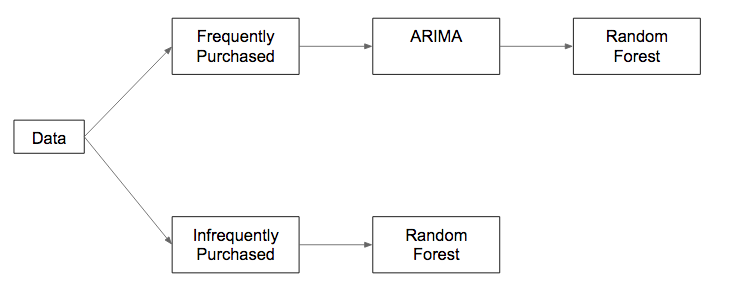

```{r setup, include=FALSE}
knitr::opts_chunk$set(echo = TRUE)
```

```{r, echo=FALSE}

# 1. Set to TRUE to import all relevant CSV files. Only need to do this once
LOAD_CSV_DATA <- FALSE

# 2. Set this value to TRUE to install all of the relevant packages. Only need to do this once
DO_INSTALL_PACKAGES <- FALSE

# 3. Set TRUE to use small sample. Set to FALSE to use more data, which may take hours  
SMALLER_SAMPLE <- TRUE

# 4. Create a directory named "plots" on the same level as this .Rmd file. This code assumes the existence of that directory, saves all charts there

if (DO_INSTALL_PACKAGES) {
  install.packages("data.table")
  install.packages('ggplot2')
  install.packages('ggthemes')
  install.packages('scales')
  install.packages('dplyr')
  install.packages('mice')
  install.packages('class')
  install.packages('lubridate')
  install.packages('caret')
  install.packages('tseries')
  install.packages("forecast")
  install.packages('tidyr')
}

library('data.table')
library('ggplot2')
library('ggthemes')
library('scales')
library('dplyr')
library('mice')
library('class')
library('lubridate')
library('caret')
library('tseries')
library('forecast')
library('tidyr')

if (LOAD_CSV_DATA) {
  train <- fread("train.csv")
  holidays <- fread("holidays_events.csv")
  items <- fread("items.csv")
  oil <- fread("oil.csv")
  stores <- fread("stores.csv")
  test <- fread("test.csv")
}

# Set names
cols <- names(holidays)[-1] # Except for date
setnames(holidays, (cols), paste("holiday_", (cols), sep=""))

cols <- names(items)[-1] # Except for item_nbr
setnames(items, (cols), paste("item_", (cols), sep=""))

setnames(oil, "dcoilwtico", "oil_price")

```

## Introduction

Forecasting sales is difficult, yet vitally important for grocery stores. Many items are perishable, and need to be sold soon after arrival. If the store orders too many supplies, they may have to discard a large portion of them. If they don’t order enough, they will miss out on potential sales when they run out of stock. An Ecuadorian-based grocery giant, Corporacion Favorita, relies on rudimentary forecasting techniques. They admit that they “currently rely on subjective forecasting methods with very little data to back them up and very little automation to execute plans.” Corporacion Favorita decided to implement data science methods in order to more accurately forecast sales. They posted a competition on Kaggle where they provided all sales data for all of their stores over a four-year period. 

We built a model to analyze the training data, and predict the test data provided by Corporacio Favorito. Our model pipeline uses historical data to predict the unit sales of a given item. The first step was combining the different datasets provided by Corporacion Favorita. The data included roughly 200,000 products, several years of transactions for 54 distinct stores, and oil prices. The first entries of each of the datasets provided are shown below.

```{r, echo=FALSE}
head(train)
head(items)
head(stores)
head(oil)
```

```{r, echo=FALSE}

# Remove NA values from oil by using last recorded price
set(oil, 1L, "oil_price", oil[2,oil_price]) # First row was NA, so use value of 2nd row
oil_price_na <- is.na(oil$oil_price)
last_oil_price <- oil[1,oil_price]
for (i in 1:length(oil_price_na)) {
  if (oil_price_na[i]) {
    set(oil, i, "oil_price", last_oil_price)
  } else {
    last_oil_price <- oil[i,oil_price]
  }
}

cols <- names(stores)[-1] # Except for store_nbr
setnames(stores, (cols), paste("store_", (cols), sep=""))

# Join with holidays_events
#setkey(train, date)
#setkey(holidays, date)
#train <- merge(train, holidays, all.x = TRUE)

# Join with items
setkey(train, item_nbr)
setkey(items, item_nbr)
train <- merge(train, items, all.x = TRUE)

# Join with oil
setkey(train, date)
setkey(oil, date)
train <- merge(train, oil, all.x = TRUE)

# Join with stores
setkey(train, store_nbr)
setkey(stores, store_nbr)
train <- merge(train, stores, all.x = TRUE)


# Same, for test data

# Join with items
setkey(test, item_nbr)
setkey(items, item_nbr)
test <- merge(test, items, all.x = TRUE)

# Join with oil
setkey(test, date)
setkey(oil, date)
test <- merge(test, oil, all.x = TRUE)

# Join with stores
setkey(test, store_nbr)
setkey(stores, store_nbr)
test <- merge(test, stores, all.x = TRUE)

# RF dataset: sample from last 15 days
set.seed(888)
if (SMALLER_SAMPLE) {
  p <- 100000/(125497040 - 123926072) # Proportion we want to sample (total, num. before Aug. 1 2016)
} else {
  p <- 1 # Use all available data for last 15 days
}
setkey(train, date)
ndt <- train[, .(n = .N), by = date]
indices <- c()
start <- end <- 1 + 123926072
num_days <- nrow(ndt)
for (i in (num_days - 14):num_days) {
  n <- ndt[i,n]
  end <- start + n - 1
  new_indices <- sample(start:end, as.integer(n * p))
  new_indices
  indices <- c(indices, new_indices)
  start <- end + 1
}
sandbox_rf <- train[indices,]
num_rf <- nrow(sandbox_rf)

# ARIMA Reduced data set to work with (whole time period)
p <- 1 # Use all training data for arima
setkey(train, date)
ndt <- train[, .(n = .N), by = date]
indices <- c()
start <- end <- 1
num_days <- nrow(ndt)
for (i in 1:num_days) {
  n <- ndt[i,n]
  end <- start + n - 1
  new_indices <- sample(start:end, as.integer(n * p))
  new_indices
  indices <- c(indices, new_indices)
  start <- end + 1
}
sandbox_arima <- train[indices,]
num_arima <- nrow(sandbox_arima)

sandbox <- rbind(sandbox_rf, sandbox_arima)
sandbox <- rbind(sandbox, test, fill=TRUE)

# Add cols for "year", "month", "weekday", "days_since_payday"

base <- c(2,5,5,1,3,6,1,4,0,2,5,0, 
          3,6,6,2,4,0,2,5,1,3,6,1, 
          4,0,0,3,5,1,3,6,2,4,0,2, 
          5,1,2,5,0,3,5,1,4,6,2,4,
          0,3,3,6,1,4,6,2)
sandbox[,year := as.integer(substr(date,0,4))]
sandbox[,month := as.integer(substr(date,6,7))]
sandbox[,weekday := as.integer(substr(date,9,10))]
sandbox[,days_since_payday := ifelse(weekday < 15, weekday, weekday - 15)]
sandbox[,weekday := ((base)[(year - 2013L)*12 + month] + weekday) %% 7]

# Make a categorical variable for each weekday
weekday_names <- c("Sun", "Mon", "Tues", "Weds", "Thurs", "Fri", "Sat")
for (i in 1:7) {
  weekday_name <- weekday_names[i]
  sandbox[,(weekday_name) := weekday == (i)]
}

# Make a categorical variable for each item family 
item_families <- unique(sandbox$item_family)
for (i in 1:length(item_families)) {
  cur_item_family <- item_families[i]
  sandbox[,(cur_item_family) := item_family == (cur_item_family)]
}

# Make a cat. var. for each store city
store_cities <- unique(sandbox$store_city)
for (i in 1:length(store_cities)) {
  cur_store_city <- store_cities[i]
  sandbox[,(cur_store_city) := store_city == (cur_store_city)]
}
# Make a binary variable for each store cluster
store_clusters <- unique(sandbox$store_cluster)
for (i in 1:length(store_clusters)) {
  cur_store_cluster <- store_clusters[i]
  sandbox[,(paste("Cluster", cur_store_cluster)) := store_cluster == (cur_store_cluster)]
}

# Make a binary variable for each store type
store_types <- unique(sandbox$store_type)
for (i in 1:length(store_types)) {
  cur_store_type <- store_types[i]
  sandbox[,(paste("Store Type", cur_store_type)) := store_type == (cur_store_type)]
}

# Adding months and days since Jan. 1 2013 (both starting at 1)
setDT(sandbox)
sandbox[,month_count := 12 * (year - 2013) + month]

# Make data table for which items are sold every day
tmp <- train[date == "2017-08-01"]
cut <- min(tmp$id)

# Choose those sold every day
setkey(train, id)
t_pop <- train[id >= (cut), j = .(n = .N), by = .(store_nbr, item_nbr)]
t_pop[,popular := n == 15]

# Class var: 0 - RF, 1 - ARIMA, 2 - TEST
setDT(sandbox)
sandbox[,class := ifelse(.I <= (num_rf), 0, ifelse(.I <= (num_rf) + (num_arima), 1, 2))]

# Split sandbox accordingly
setDT(t_pop)
setkey(sandbox, store_nbr, item_nbr)
setkey(t_pop, store_nbr, item_nbr)
s_all <- merge(sandbox, t_pop, all.x = TRUE)

# For NA values, assume popular is false
s_all[,popular := ifelse(is.na(popular),FALSE,popular)]

sandbox_rf2 <- s_all[class == 0]
sandbox_rf2[,class:=NULL]
arima2 <- s_all[class == 1]
arima2[,class:=NULL]
test2 <- s_all[class == 2]
test2[,class:=NULL]

rf_popular <- sandbox_rf2[popular == TRUE]
rf_not_popular <- sandbox_rf2[popular == FALSE]
arima_popular <- arima2[popular == TRUE]
test_popular <- test2[popular == TRUE]
test_not_popular <- test2[popular == FALSE]

family_data <- data.frame()
daily_sales <- arima_popular %>% group_by(date,item_family) %>% summarise(daily_class_sales = mean(unit_sales)) %>% filter(date > as.Date('2016-1-1')) #take the data from 2016 onwards 

for (i in unique(daily_sales$item_family)){
  daily_sales_ts <- daily_sales %>% filter(item_family == i) #filter by the class
  ds_ts <- ts(daily_sales_ts$daily_class_sales, frequency = 7) #create the time series with a week period
  ds_ts <- tsclean(ds_ts) #remove outliers
  ds_ts_arima <- auto.arima(ds_ts) #take out stepwise and 
  #approximation to make it go faster
  forecast <- forecast(ds_ts_arima, h= 14) #forecast 14 days ahead
  forecast_values <- forecast$mean #obtain the values for the forecast
  family_data <- rbind(family_data, forecast_values) #add these to the dataframe
}

family_data <- cbind(unique(daily_sales$item_family), family_data) #add family names to data frame
colnames(family_data) <- c("Family",1:14)

tidy_family_data <- gather(family_data,"Day","Sales",2:15) #tidy up
tidy_family_data$Day <- as.numeric(tidy_family_data$Day)

# Clean up to get cols "date", "item_family", "popularity"

train_pop_data <- daily_sales
setDT(train_pop_data)
setnames(train_pop_data, "daily_class_sales", "popularity")

test_pop_data <- tidy_family_data
setDT(test_pop_data)
setnames(test_pop_data, c("Family", "Day", "Sales"), c("item_family","date","popularity"))
test_dates <- unique(test$date)
test_pop_data[,date := (test_dates)[date]]

# Join with rf_popular and test_popular

setkey(rf_popular, date, item_family)
setkey(train_pop_data, date, item_family)
rf_popular <- merge(rf_popular, train_pop_data, all.x = TRUE)

setkey(test_popular, date, item_family)
setkey(test_pop_data, date, item_family)
test_popular <- merge(test_popular, test_pop_data, all.x = TRUE)

# Change NA values to 0
rf_popular[,popularity := ifelse(is.na(popularity),0,popularity)]
test_popular[,popularity := ifelse(is.na(popularity),0,popularity)]

# Train/test data for popular items
s_p_indices <- sample(1:nrow(rf_popular), 0.7*nrow(rf_popular))
s_p_train <- rf_popular[s_p_indices]
s_p_test <- rf_popular[-s_p_indices]

# Train/test data for unpopular items
s_np_indices <- sample(1:nrow(rf_not_popular), 0.7*nrow(rf_not_popular))
s_np_train <- rf_not_popular[s_np_indices]
s_np_test <- rf_not_popular[-s_np_indices]

# Variables to use for the random forest
s_p_cols <- s_np_cols <- c("unit_sales", item_families, paste("Cluster",store_clusters), store_cities, paste("Store Type", store_types), weekday_names, "days_since_payday", "item_perishable", "oil_price")
s_p_cols <- c(s_p_cols, "popularity")

# Model for popular items
p_model_data <- s_p_train[,s_p_cols, with=FALSE]
set.seed(888)
pmdreduced <- p_model_data[7]
p_model <- train(unit_sales ~ . , data=pmdreduced, method="rf",
                  trControl = trainControl(method="oob"),  # Use the OOB error rate 
                  ntree=500, tuneGrid = data.frame(mtry=((length(s_p_cols) - 1))/3),
                  importance = TRUE)  # need this for variable importance below
p_predictions <- predict(p_model, newdata = s_p_test)
p_predictions <- ifelse(p_predictions < 0, 0, p_predictions)
p_actual <- s_p_test$unit_sales
p_actual <- ifelse(p_actual < 0, 0, p_actual)
p_accuracy <- sum((log(p_predictions + 1) - log(p_actual + 1)) ** 2) / length(p_predictions)
p_accuracy

# Model for unpopular items
np_model_data <- s_np_train[,s_np_cols, with=FALSE]
set.seed(888)
np_model <- train(unit_sales ~ . , data=np_model_data, method="rf",
                  trControl = trainControl(method="oob"),  # Use the OOB error rate 
                  ntree=500, tuneGrid = data.frame(mtry=((length(s_np_cols) - 1))/3),
                  importance = TRUE)  # need this for variable importance below
np_predictions <- predict(np_model, newdata = s_np_test)
np_predictions <- ifelse(np_predictions < 0, 0, np_predictions)
np_actual <- s_np_test$unit_sales
np_actual <- ifelse(np_actual < 0, 0, np_actual)
np_accuracy <- sum((log(np_predictions + 1) - log(np_actual + 1)) ** 2) / length(np_predictions)
np_accuracy

# Importance
p_model_imp <- varImp(p_model)$importance
np_model_imp <- varImp(np_model)$importance

# Predict test_popular and test_not_popular
test_p_predictions <- predict(p_model, newdata = test_popular)
test_p_predictions <- ifelse(test_p_predictions < 0, 0, test_p_predictions)
test_np_predictions <- predict(np_model, newdata = test_not_popular)
test_np_predictions <- ifelse(test_np_predictions < 0, 0, test_np_predictions)

# Output to csv
final_predictions <- data.table(id = c(test_popular$id, test_not_popular$id), unit_sales = c(test_p_predictions, test_np_predictions))
fwrite(final_predictions, "final_predictions.csv")

```

## Data Wrangling

We combined these different datasets with the training data. We joined these datasets together with various unique identifiers, such as item number, store number and date. We also added some additional variables as well including: 
*categorical variables for weekday, item family, store city
*binary variables for store cluster and type
*numerical variables for months and days since the first date of the dataset

The final training dataset column names are given below:

```{r, echo=FALSE}
head(train)
```

## Pipeline

A diagram of the dual model pipeline is shown below:



We split our dataset into two groups: items that were purchased frequently and infrequently. For a given item, it is considered frequently purchased if for every store it is sold in, it was purchased every day the store was open. For training the model, only the last two weeks were considered (the two weeks leading up to the testing dataset). A graph of the distribution of item popularities is shown below.

```{r, echo=FALSE}

ggplot(data = t_pop) + geom_histogram(aes(x = n, y =..density..)) + xlab("Number of Days Sold 8/1/16 to 8/15/16") + ggtitle("Distribution of Item Popularities")
ggsave("plots/popularity_distribution.jpg")

```

We divided our data this way because of an important nuance to the data. Interestingly, our training and test data sets are composed of unit sales by item and store conditional on their purchase. We don’t have data on items that weren’t purchased and have no information on which items are in stock. Forecasting sales for items that don’t have data every day would be fitting a model to dangerously incomplete data. Consequently, in order to responsibly use the ARIMA model to pick up patterns over time, we must limit its scope to the frequently purchased items described above.

The ARIMA Model:

The ARIMA model is ideal for short-term forecasts of time series with one seasonal component. Separating this procedure by its distinct components is the best way of understanding its functionality.

The “I” - Before we can talk about the relationship between a current value and its past instances, it is important to simplify the data. 

```{r, echo=FALSE}

ggplot() + geom_line(data = tidy_family_data, aes(x= Day, y= Sales, color = Family)) #plot
ggsave("plots/arima_forecasts.jpg")

```

For infrequently purchased items a random forest was used on the dataset. A random forest is an ensemble method that combines many regression decision trees. A regression decision tree creates splits a dataset on a variable at each branch. The regression value output of a sample is an average of every value in the leaf node of the tree. A random forest, averages all of the values of many regression trees together to create a final output value. The processing of averaging together the results of many trees helps reduce bias and variance. The decision tree for the infrequently purchased items is shown below:

We used a sample of 300,000 observations from the 15 days of our dataset that came directly before the 14 days in the test dataset. The 15 days correspond to 8/1/2016 through 8/15/2016. Our computational power was limited, so we decided that the most recent data would be the most relevant to predicting short-run test observations, as seasonal trends would not have a large effect over a short period of time. Additionally, there were no major holidays or unusual occurrences such as a recession or a natural disaster during the entire month of August 2016 in Ecuador, which further supports that sales trends in the first 15 days of the month are likely to be relatively similar to sales trends in the next 14 days of the month.

We included the following variables in our random forest:
Item family
Item perishable
Store city
Store cluster
Store type
Day of week
Days since payday
Oil price
Popularity


## Findings

All of these variables had an impact on the expected number of unit sales, as can be seen in the plots below:

```{r, echo=FALSE}

# How item_family affects sales
item_family_sales <- rf_popular[,j = .(mean_sales = mean(unit_sales)), by = item_family]
ggplot(data = item_family_sales) + geom_col(aes(x = item_family, y = mean_sales)) +
  expand_limits(y = 0) + theme(axis.text.x = element_text(angle = 90, hjust = 1)) + 
  xlab("Item Family") + ylab("Mean Unit Sales") + ggtitle("Effect of Item Family for Highly-Transacted Items")
ggsave("plots/1p.jpg")

# How store_city affects sales
store_city_sales <- rf_popular[,j = .(mean_sales = mean(unit_sales)), by = store_city]
ggplot(data = store_city_sales) + geom_col(aes(x = store_city, y = mean_sales)) +
  expand_limits(y = 0) + theme(axis.text.x = element_text(angle = 90, hjust = 1)) +
  xlab("Store City") + ylab("Mean Unit Sales") + ggtitle("Effect of Store City for Highly-Transacted Items")
ggsave("plots/2p.jpg")

# How store_cluster affects sales
store_cluster_sales <- rf_popular[,j = .(mean_sales = mean(unit_sales)), by = store_cluster]
ggplot(data = store_cluster_sales) + geom_col(aes(x = store_cluster, y = mean_sales)) +
  expand_limits(y = 0) + 
  xlab("Sore Cluster") + ylab("Mean Unit Sales") + ggtitle("Effect of Store Cluster for Highly-Transacted Items")
ggsave("plots/3p.jpg")

# How store_type affects sales
store_type_sales <- rf_popular[,j = .(mean_sales = mean(unit_sales)), by = store_type]
ggplot(data = store_type_sales) + geom_col(aes(x = store_type, y = mean_sales)) +
  expand_limits(y = 0) + 
  xlab("Store Type") + ylab("Mean Unit Sales") + ggtitle("Effect of Store Type for Highly-Transacted Items")
ggsave("plots/4p.jpg")

# How day of week affects sales
weekday_sales <- rf_popular[,j = .(mean_sales = mean(unit_sales)), by = weekday]
weekday_sales[,weekday := (weekday_names)[weekday + 1]]
weekday_sales$weekday <- factor(weekday_sales$weekday, levels = (weekday_names))
ggplot(data = weekday_sales) + geom_col(aes(x = weekday, y = mean_sales)) +
  expand_limits(y = 0) +
  xlab("Day of Week") + ylab("Mean Unit Sales") + ggtitle("Effect of Day of Week for Highly-Transacted Items")
ggsave("plots/5p.jpg")

# How days since payday affects sales
days_since_payday_sales <- rf_popular[,j = .(mean_sales = mean(unit_sales)), by = days_since_payday]
ggplot(data = days_since_payday_sales) + geom_col(aes(x = days_since_payday, y = mean_sales)) +
  expand_limits(y = 0) + 
  xlab("Days Since Payday") + ylab("Mean Unit Sales") + ggtitle("Effect of Days Since Payday for Highly-Transacted Items")
ggsave("plots/6p.jpg")

# How oil price affects sales
oil_price_sales <- rf_popular[,j = .(mean_sales = mean(unit_sales)), by = oil_price]
ggplot(data = oil_price_sales) + geom_smooth(aes(x = oil_price, y = mean_sales)) +
  expand_limits(y = 0) + 
  xlab("Oil Price") + ylab("Mean Unit Sales") + ggtitle("Effect of Oil Price for Highly-Transacted Items")
ggsave("plots/7p.jpg")

# How item perishibality affects sales
item_perishable_sales <- rf_popular[,j = .(mean_sales = mean(unit_sales)), by = item_perishable]
ggplot(data = item_perishable_sales) + geom_col(aes(x = item_perishable, y = mean_sales)) +
  expand_limits(y = 0) + 
  xlab("Item Perishable") + ylab("Mean Unit Sales") + ggtitle("Effect of Item Perishability for Highly-Transacted Items")
ggsave("plots/8p.jpg")


## Same code, but for non-highly-transacted items

# How item_family affects sales
item_family_sales <- rf_not_popular[,j = .(mean_sales = mean(unit_sales)), by = item_family]
ggplot(data = item_family_sales) + geom_col(aes(x = item_family, y = mean_sales)) +
  expand_limits(y = 0) + theme(axis.text.x = element_text(angle = 90, hjust = 1)) + 
  xlab("Item Family") + ylab("Mean Unit Sales") + ggtitle("Effect of Item Family for Non-Highly-Transacted Items")
ggsave("plots/1np.jpg")

# How store_city affects sales
store_city_sales <- rf_not_popular[,j = .(mean_sales = mean(unit_sales)), by = store_city]
ggplot(data = store_city_sales) + geom_col(aes(x = store_city, y = mean_sales)) +
  expand_limits(y = 0) + theme(axis.text.x = element_text(angle = 90, hjust = 1)) +
  xlab("Store City") + ylab("Mean Unit Sales") + ggtitle("Effect of Store City for Non-Highly-Transacted Items")
ggsave("plots/2np.jpg")

# How store_cluster affects sales
store_cluster_sales <- rf_not_popular[,j = .(mean_sales = mean(unit_sales)), by = store_cluster]
ggplot(data = store_cluster_sales) + geom_col(aes(x = store_cluster, y = mean_sales)) +
  expand_limits(y = 0) + 
  xlab("Sore Cluster") + ylab("Mean Unit Sales") + ggtitle("Effect of Store Cluster for Non-Highly-Transacted Items")
ggsave("plots/3np.jpg")

# How store_type affects sales
store_type_sales <- rf_not_popular[,j = .(mean_sales = mean(unit_sales)), by = store_type]
ggplot(data = store_type_sales) + geom_col(aes(x = store_type, y = mean_sales)) +
  expand_limits(y = 0) + 
  xlab("Store Type") + ylab("Mean Unit Sales") + ggtitle("Effect of Store Type for Non-Highly-Transacted Items")
ggsave("plots/4np.jpg")

# How day of week affects sales
weekday_sales <- rf_not_popular[,j = .(mean_sales = mean(unit_sales)), by = weekday]
weekday_sales[,weekday := (weekday_names)[weekday + 1]]
weekday_sales$weekday <- factor(weekday_sales$weekday, levels = (weekday_names))
ggplot(data = weekday_sales) + geom_col(aes(x = weekday, y = mean_sales)) +
  expand_limits(y = 0) +
  xlab("Day of Week") + ylab("Mean Unit Sales") + ggtitle("Effect of Day of Week for Non-Highly-Transacted Items")
ggsave("plots/5np.jpg")

# How days since payday affects sales
days_since_payday_sales <- rf_not_popular[,j = .(mean_sales = mean(unit_sales)), by = days_since_payday]
ggplot(data = days_since_payday_sales) + geom_col(aes(x = days_since_payday, y = mean_sales)) +
  expand_limits(y = 0) + 
  xlab("Days Since Payday") + ylab("Mean Unit Sales") + ggtitle("Effect of Days Since Payday for Non-Highly-Transacted Items")
ggsave("plots/6np.jpg")

# How oil price affects sales
oil_price_sales <- rf_not_popular[,j = .(mean_sales = mean(unit_sales)), by = oil_price]
ggplot(data = oil_price_sales) + geom_smooth(aes(x = oil_price, y = mean_sales)) +
  expand_limits(y = 0) + 
  xlab("Oil Price") + ylab("Mean Unit Sales") + ggtitle("Effect of Oil Price for Non-Highly-Transacted Items")
ggsave("plots/7np.jpg")

# How item perishibality affects sales
item_perishable_sales <- rf_not_popular[,j = .(mean_sales = mean(unit_sales)), by = item_perishable]
ggplot(data = item_perishable_sales) + geom_col(aes(x = item_perishable, y = mean_sales)) +
  expand_limits(y = 0) + 
  xlab("Item Perishable") + ylab("Mean Unit Sales") + ggtitle("Effect of Item Perishability for Non-Highly-Transacted Items")
ggsave("plots/8np.jpg")

```

We split the categorical variables “item family,” “store city,” “store cluster,” “store type,” and “day of week” into many binary variables. The variable “item perishable” was already binary, and the variables “days since payday,” “oil price,” and “popularity” were continuous.

“Store cluster” and “store type” were provided to us by Corporacion Favorita without much intuition as to what different clusters and types actually correspond to. While this felt a bit odd, we decided to nonetheless include these variables in our random forest model because they demonstrated that they had a large influence on the expected number of unit sales.

In the public sector of Ecuador, paydays occur on the 15th day of each month, as well as on the last day of each month. We speculated that workers would tend to spend more soon after their payday. Although our data did not definitively show a trend, we decided to include this variable because Corporacion Favorita recommended that we do so.

The data for oil price given to us in the dataset was incomplete, with about half of the values missing. The missing values were very evenly dispersed, so we fixed this problem by replacing missing values with the most recently occurring non-missing value.

The “popularity" variable was created by applying the ARIMA model to each row in the training dataset. All the other variables were included in both random forests, while the “popularity” variable was only included in the random forest for highly-transacted items.

We trained our random forest and found that the following variables were important:

```{r, fig.width=3,fig.height=7, echo=FALSE}

ggplot(varImp(p_model, n = 10))
ggsave("plots/varimp_p.jpg")
ggplot(varImp(np_model, n = 10))
ggsave("plots/varimp_np.jpg")

```

Variable importances for the random forest

Variables corresponding to item family were among the most important. This is not surprising because the charts above demonstrated that item family exhibited the strongest influence on expected unit sales out of all of the variables that we included in the random forest model. “Popularity” was also an important variable, which means that our ARIMA model indeed contributed useful information.

We held out 30% of our 300,000 observations as test data, and used these to analyze the accuracy of our model.

```{r, echo=FALSE}

p_err <- p_predictions - p_actual
p_err_prop <- p_err/p_actual
np_err <- np_predictions - np_actual
np_err_prop <- np_err/np_actual

ggplot(data = data.table(error = p_err)) + geom_density(aes(x = error)) + 
  xlim(-50, 50) + xlab("Prediction Minus Actual") + 
  ggtitle("Random Forest Prediction Errors for Highly-Transacted Items")
ggsave("plots/err_p.jpg")

ggplot(data = data.table(error = p_actual)) + geom_density(aes(x = error)) + 
  xlim(0, 50) + xlab("Unit Sales") + 
  ggtitle("Unit Sales for Highly-Transacted Items")
ggsave("plots/actual_p.jpg")

ggplot(data = data.table(error = p_err_prop)) + geom_density(aes(x = error)) +
  xlim(-2, 15) + xlab("Scaled Error") + 
  ggtitle("Scaled Random Forest Prediction Errors for Highly-Transacted Items")
ggsave("plots/err_scaled_p.jpg")

ggplot(data = data.table(error = np_err)) + geom_density(aes(x = error)) + 
  xlim(-20, 20) + xlab("Prediction Minus Actual") + 
  ggtitle("Random Forest Prediction Errors for Non-Highly-Transacted Items")
ggsave("plots/err_np.jpg")

ggplot(data = data.table(error = np_actual)) + geom_histogram(aes(x = error), binwidth = 1) + 
  xlim(0, 20) + xlab("Unit Sales") + 
  ggtitle("Unit Sales for Non-Highly-Transacted Items")
ggsave("plots/actual_np.jpg")

ggplot(data = data.table(error = np_err_prop)) + geom_density(aes(x = error)) +
  xlim(-2, 15) + xlab("Scaled Error") + 
  ggtitle("Scaled Random Forest Prediction Errors for Non-Highly-Transacted Items")
ggsave("plots/err_scaled_np.jpg")

```

Overall our model did a mediocre job predicting sales. The variance was TODO. It often predicted incorrectly, often by a large factor.

To predict the Kaggle test set, we first split the test set into highly-transacted and non-highly-transacted items based off our existing classification. Corporacion Favorita included a small number of items not seen in the training set in their test set. We labeled these items as non-highly-transacted because the majority of items are non-highly-transacted. After splitting the data, we applied the appropriate random forest to each half of the data, and merged and submitted the results. Our submission ended up in the 10th percentile. This was a disappointing result.

## Limitations

The most important improvement we could make to increase the accuracy of our model would be to use more data. We only used 0.25% of the 125 million training observations provided by Corporacion Favorita to train our random forest models. With more computational power, we could train more accurate models, and generate more accurate predictions.

Another improvement to the model would be to incorporate external data sets into our analysis. These include data relevant to the holidays, which can impact demand for specific items associated with cultural customs related to the holidays. Second, economic data about the country of Ecuador would also have been useful. Economic data would give a sense of the spending power of customers, and help forecast larger trends in demand of different items. Third, weather data also likely impacted sales. While month gives a good approximation, deviations beyond the average weather cycles likely also affect the demand for certain items. Including external data sets would be useful in making a model that predicts long-term trends, forecasting months into the future. Including these datasets is not as relevant to the challenge we faced, which was only to predict data for the next two weeks. Across the 29 days spanned by the training and test data we used, these measures did not change much. For example, Ecuador’s unemployment rate was 5.4% in 2016 and 5.8% in 2017, and the monthly change was likely even smaller than that.

We could make our model more realistic by adding data for when there were zero sales. This would allow us to put all of our data through the ARIMA pipeline. Time series models assumes data points exist for every day. These models can only apply to items that have data for every day, which in this case was limited to highly-transacted items. Adding zero data would allow us to apply time series forecasting to the whole dataset. Although adding zero data would cause our model to generate more realistic predictions, these predictions would likely do more poorly in the Kaggle competition, as the test data also doesn’t include data for when there were no sales, and thus the competition favors models that overestimate sales.

Our models are only trained on Corporacion Favorita stores in Ecuador. This limits the generalizability of the models produced from this code. There would likely be limitations to applying these models to different countries, or even different grocers within Ecuador.